# Coinz
ILP Coursework

Kiril Rechanski
s1527764

## 🌎 Android location game app written in Java

The objective of the game is to collect coins in three different currencies (**DOLR, SHIL, PENY, QUID**) located around the main campus of the University of Edinburgh. The user then can exchange the collected coins for gold, which is stored into the bank.

The application uses Firebase Firestore Database and Authentication to guarantee enjoyable user experience and data persistance.

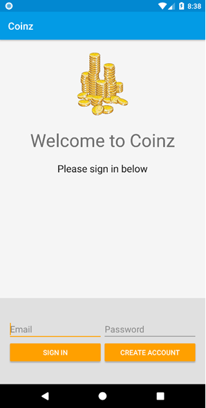

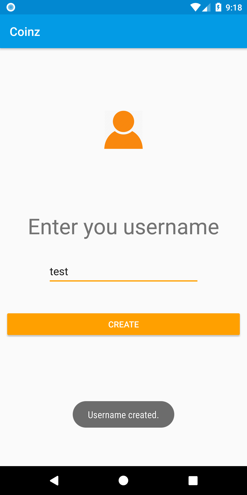

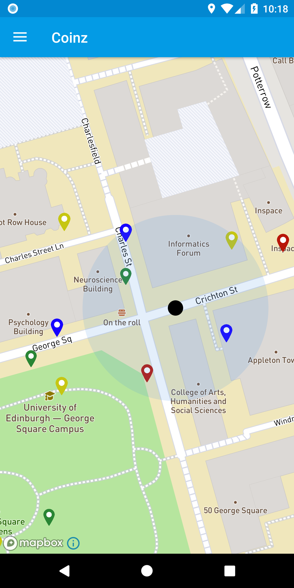

### Statisctics

The statistics tab displays the distance, the player has walked today, as well as the total distance walked while playing the game.

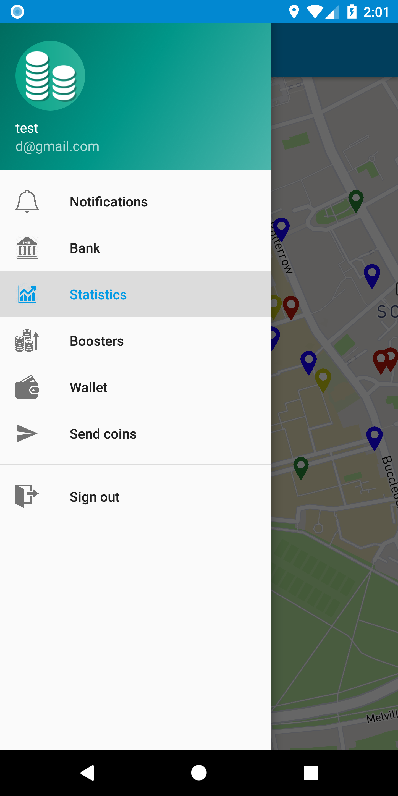

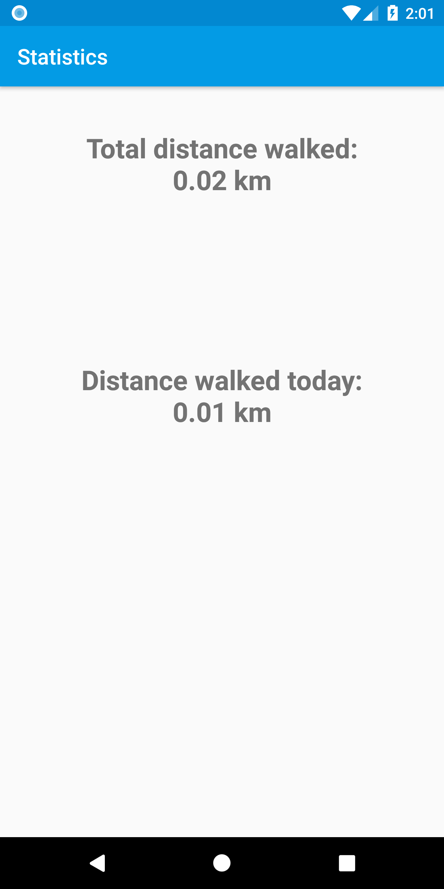

### Boosters

The player can purchase boosters which give them the ability to collect coins more easily.

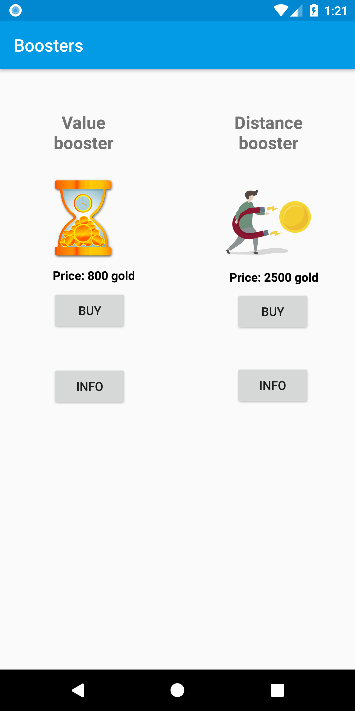

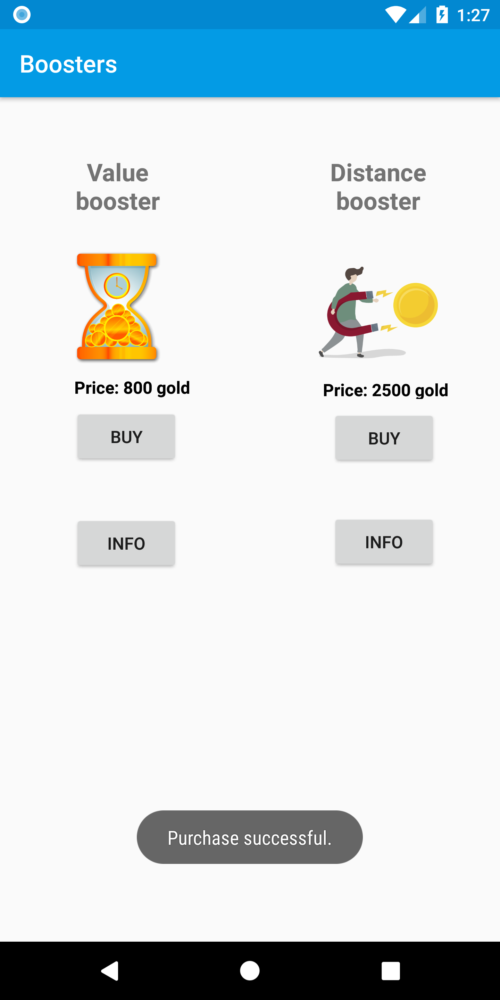

### Sending coins

Sending coins is done when the player has banked his **25 coins** for the day. From the navigation drawer he clicks **Send coins** from where a *PopUp* is displayed, asking for the ricipient's *username*. After that, he is directed to the *Wallet* where he can choose coins and click *Send Coins*. If it is successfull a message is displayed showing how much gold they've sent and to whom.

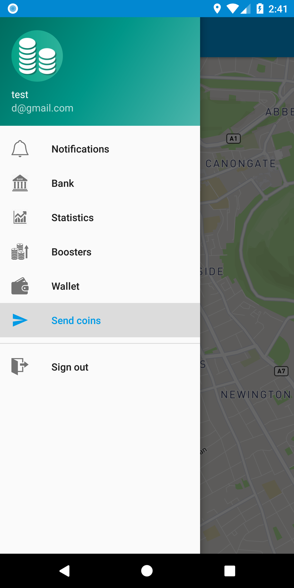

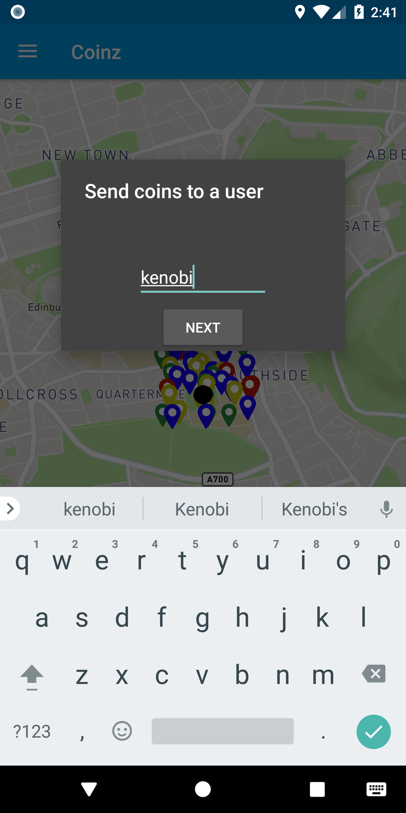

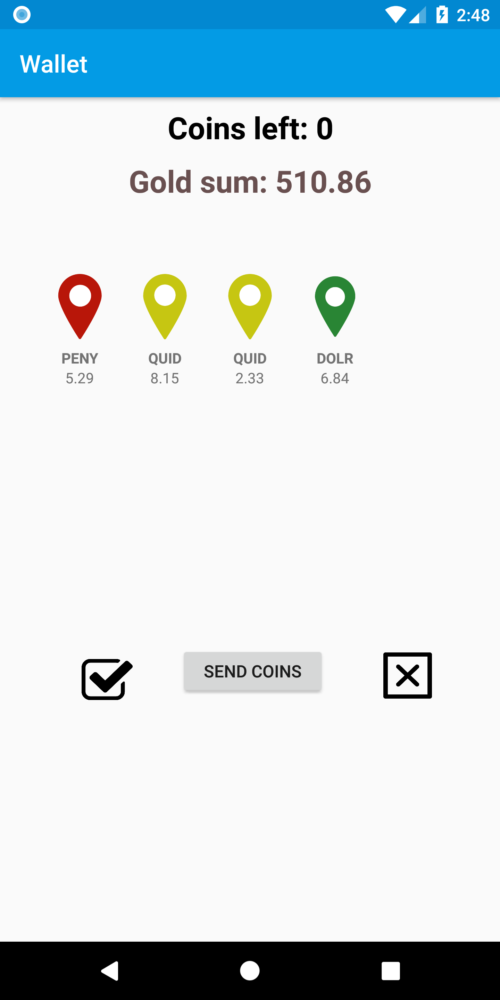

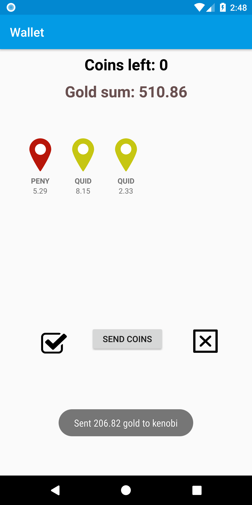
